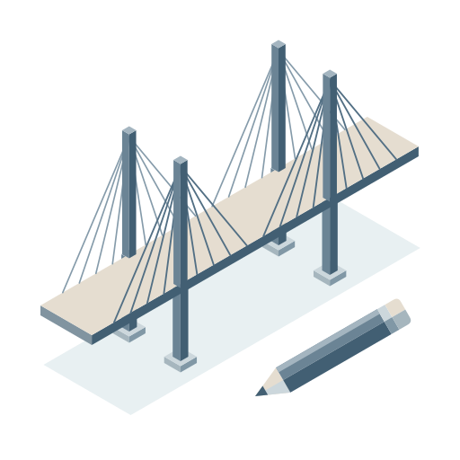

# BridgeBuilder



A Cities: Skylines II mod that builds a **bridge prefab** from parts you choose: a road for the upper
deck, a bridge style to wear, and optionally something hung underneath.

The rules generation is held to are in [AGENTS.md](AGENTS.md).

## License

This project's original code is available under the [MIT License](LICENSE).
Game assets and third-party dependencies retain their respective licenses.

## In-game builder and identity

The floating BridgeBuilder button opens the runtime builder in a loaded game. Roads are shown as
icon-and-name cards (three per row); double-deck mode provides independent upper and lower network
lists. Bridge styles are likewise selected from prototype cards, and unavailable styles are omitted
when their providing DLC or mod is not installed. Creating a bridge publishes it into the running
prefab world and activates the ordinary network construction tool; it does not place anything by
itself.

Every bridge created there has two deliberately separate names:

- `PrefabName`: immutable `b<UUID>` identity, for example
  `b6f9619ff-8b86-d011-b42d-00c04fc964ff`. Saved references, activation and deletion use only this key.
- registration name: the editable name shown in game. It can be duplicated or renamed without
  changing the prefab identity or reconstructing the bridge.

The management tab lists these bridges and supports activation, display-name changes and deletion.
Construction inputs are read-only after creation; changing them means creating another UUID-backed
bridge. Deleting a bridge asks for confirmation and removes its placed instances before removing its
asset record.

It is the parallel of [Road Prefab Exporter](../CS2RoadPrefabExporter) and shares its code — see
[Layout](#layout).

## One bridge at a time

There is no batch mode, and that is not a simplification of one. A bridge is a **pairing** — this
deck on top, that one underneath, in this style — and a pairing does not distribute over a list of
roads. So the page asks for the two decks explicitly and builds exactly one bridge. The road exporter
next door remains the batch tool.

## What you can pick

Each bridge style binds to a single content source for both display and generation. Base-game
variants take precedence over DLC variants, then mod variants; ties use stable source identifiers,
not translated labels. A selected unavailable prerequisite does not trigger a fallback to another
owner. The V-pylon double-deck cable-stayed bridge (`Extradosed01`) accepts base-game variants only,
never the duplicate Bridge Expansion Pack version. Existing bridge assets are unchanged.

The DLC landmark `GoldenGate` supports **single-deck generation only**. The separate Bridge Expansion
Pack style `GoldenGateDouble` uses its own double-deck archetype. Preview/export/create requests must
respect each style's supported arrangement. Existing saved bridges are not reconstructed by this rule.

Road Builder is **optional compatibility, not a required dependency**. Without it installed and
successfully loaded in the current playset, its roads are omitted from both deck selectors. Base-game
roads, pedestrian paths and tracks remain available. Cached Road Builder prefabs do not enable the
integration; standalone plain-road exports remain ordinary roads. The mod does not load or ship
RoadBuilder.dll, and Road Builder must not be declared a mandatory dependency when publishing it.

The upper and lower deck are chosen from everything registered in the loaded world:

| Kind | What it covers |
|---|---|
| Road Builder | roads generated by Road Builder, with their configuration still attached |
| Road | every other road — the game's own, a pack's, or one exported earlier by either mod |
| Train / Subway / Tram | the rail, subway and tram tracks |

Each entry is labelled with its kind, its in-game name and its measured width, because the width is
what decides which variant of the chosen style will fit.

Both deck selectors accept the supported network kinds above. Generation still requires a matching
bridge archetype and valid network data. Leaving the lower deck empty selects a single-deck bridge;
choosing the same road for both creates two independent deck networks.

**Bridges are never offered as decks.** A bridge already carries its own span behaviour, towers and
pillars; draping a second bridge over that gives two structures fighting for the same space. It also
keeps a generated bridge out of the list it came from, which would otherwise let one run's output
become the next run's input and compound the error each time. For the same reason a generated bridge
is not offered as a *style* donor either.

## Bridge styles

A fixed, named list — Suspension, Extradosed, Cable-Stayed, Truss Arch, Tied Arch, Grand, Bascule,
Lift, Pedestrian Bascule, Covered Wooden — translated into all twelve shipped languages.

It is fixed rather than assembled from whatever is registered, because the options page is built when
the mod loads, long before any world exists; a discovered list would be empty exactly when you first
open it. Discovery still runs, and supplies the **variants**: which prefabs provide each style and
how wide each was authored. The base game covers most of the list (`SuspensionBridge01`–`04`,
`ExtradosedBridge02`–`04`, `TrussArchBridge02`–`03`, the draw and lift bridges, the pedestrian ones);
asset packs fill in the rest. A style with nothing behind it is shown as *(not available)* rather
than silently missing, and a pack bridge matching no named style is appended under its own name.

The opening mechanism of draw and lift bridges is carried over, so a converted lift bridge still
lifts.

A generated bridge **references** its style's towers and cables rather than copying them, so it keeps
needing whatever supplied them. The status panel names that source before you generate. See
[docs/BridgeModel.md](docs/BridgeModel.md) for the data model this rests on.

### Width

The closest-width variant is picked and its structure moved sideways to the deck edges. Meshes are
not stretched — beyond about 2× the look stops matching the style, so the fit is clamped and both the
status panel and the report say so.

## Double decks

Double decks use the matching archetype's `AuxiliaryNets` arrangement. The main network may be the
upper or lower deck; ownership does not determine its physical height. Deck separation and placement
come from the archetype and are not adjustable. The lower-deck direction toggle changes the selected
network's direction while preserving that arrangement. A style without a matching double-deck
archetype is refused.

Each generated deck has its own bridge-owned network copy. The auxiliary is placed with its carrier;
its independent editing and connections remain subject to the game's auxiliary-network behavior.

## Legacy options-page naming

```
<upper deck>_<lower deck>_<style>        two decks
<upper deck>_<style>                    single deck
<name> (1), (2), ...                    when the identifier is already taken
```

Every part is the untranslated identifier - the name registered in Road Builder, or the prefab name -
so switching language never renames an asset. The name records the whole pairing because a bridge is
defined by all three: two bridges differing in any one of them are different assets and must not
overwrite each other. Re-running the *same* pairing does replace its own earlier output rather than
leaving a second copy beside it.

## Building

```powershell
tools\Build.ps1
```

```powershell
tools\Install.ps1
```

`Build.ps1` compiles the checked-in source snapshot at `vendor/CS2ModShared/src` and verifies its
SHA-256 manifest with `tools/CheckSharedSources.ps1`. A sibling repository is not needed. The script
resolves the installed game assemblies; pass `-GameDir` to override. Game assemblies and the .NET SDK
are still external build prerequisites; the shared snapshot alone does not pin those versions.

## Layout

```
CS2ModShared/               shared - discovery, cloning, asset IO, speed-limit correction, status model
CS2RoadPrefabExporter/      exports Road Builder roads as plain roads, in batches
CS2BridgeBuilder/            this repository
```

The shared code is **compiled into** each mod rather than referenced as an assembly: its types are
`internal`, and a CS2 mod ships as a single DLL. The one thing it needs from its host — an id, a log,
a page-rebuild callback and the export naming policy — comes through `ModHost`.

The sibling projects describe the source family. This checkout builds from its own reviewed snapshot; see `vendor/CS2ModShared/README.md` for update instructions.

## Reports

Every run writes `ModsData\BridgeBuilder\last-export-report.txt`, including the structural
counts that separate "the deck came out wrong" from "the style did not attach": sections, overhead
sections, sub-objects and auxiliary nets. Generation failures are recorded in the report and shown
through localized UI status. Preview failures retain technical warnings; explicit deletion failures
retain critical diagnostics.

The log line `Bridge styles: N of M available, from D donor prefab(s) out of K bridge-capable
prefab(s)`, followed by one line per style, is the authoritative record of what discovery bound.

## What the composer does not touch

The road's own `m_Sections` are left exactly as they are.

An earlier version also appended the donor's elevated-only sections, to pick up the deck edges. That
is the one operation that changes how the net tiles across its own width — the composition system
lays sections side by side and computes their offsets, so sections authored for a different net at a
different width are not decoration but a second, conflicting layout. Everything the composer still
copies is additive: drawn above the deck, or anchored alongside it.

Fixed spans are copied only when the deck has sections that respond to the states they set. A fixed
segment declares "this span is N metres and sets state X"; the sections that answer X stay with the
donor, so copying the declaration alone lays the structure out around a main span that is never
built - which is what "placed, but the parts did not join up" looks like. Deck props anchored to a
fixed span go with them: `m_FixedIndex` is read by a compiled job with no bounds check, so an index
past the end of the array is not an exception but a hard crash.

Donor selection ranks by kind before width: a road deck prefers a road donor over a track one, and a
single-deck bridge prefers a single-deck donor. Width alone once picked a double-deck *train* bridge
to drape over a road, because it happened to be the closest match in metres.

### Geometry fitting

Every style routes to its own generator. Towers, cable pieces and LODs are private derived assets
owned by the generated bridge. The selected road supplies its network structure; bridge behavior,
components, materials and placement follow the matching archetype.

Recorded authored parts that reach the centre line stretch across their own span. Side parts move
rigidly by half the width change. Full-detail geometry and every LOD use the same part classification.
Missing supported metadata is a generation failure, not permission to guess a different bridge.
Game assets and derived content remain subject to their original licenses.

### Creation durability and recovery

Runtime creation first atomically writes a `pending` UUID registration, before saving any geometry or
prefab. It commits that record only after native initialization succeeds. Pending entries are excluded
from management and placement; after a process restart the registration guard rejects their graph.
Boot inspection backs up and retires the UUID-owned prefab, CID and geometry files, then removes the
pending record. This is a compensating transaction: live native indices/meshes are retained until
world teardown, rather than destroyed during a failed creation. Interrupted retirement can be retried.

The registry uses a flushed temporary file and atomic replacement, keeping the previous version in
`bridge-registry.tsv.bak`. Malformed or unreadable input blocks writes and automatic retirement.
Restore a verified registry backup manually with the game stopped; the mod never silently replaces
unreadable data with an empty registry. Export-state is an ancillary cache, not the runtime commit point.

### Source layout and checks

`BridgeGenerationSystem` is split into lifecycle/catalogue, composition, preview, management, recovery
and removal partial files. Source-policy checks read all these files together.

Non-visual checks include `tools/RegistryCheck` (real filesystem failure cases), `tools/DiskAuditCheck`
(interrupted creation and scoped recovery), `tools/PublicationCheck`, and `tools/Check*.mjs` (UI,
localization and source policy). Renderer failures keep technical warning logs; preview/generation do
not raise error popups. Explicit deletion failures retain their critical diagnostics.

These checks and a successful build do not establish in-game visual correctness or save compatibility.
